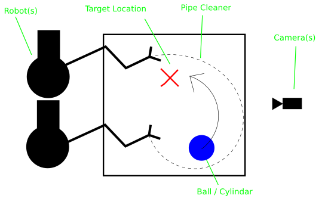

# Flexible-Tool

This repo contains code relating to the flexible tool experiment. We aim to
have a robot automatically design a wire-based tool and then use it for simple
manipulation tasks. 

## Subsections:
 - bending_calculations: Contains code relating to bending wire to match a
    shape. It has tools for moving a shape between euclidean space and A 
    space, and in-progress RL models for selecting bend points.
